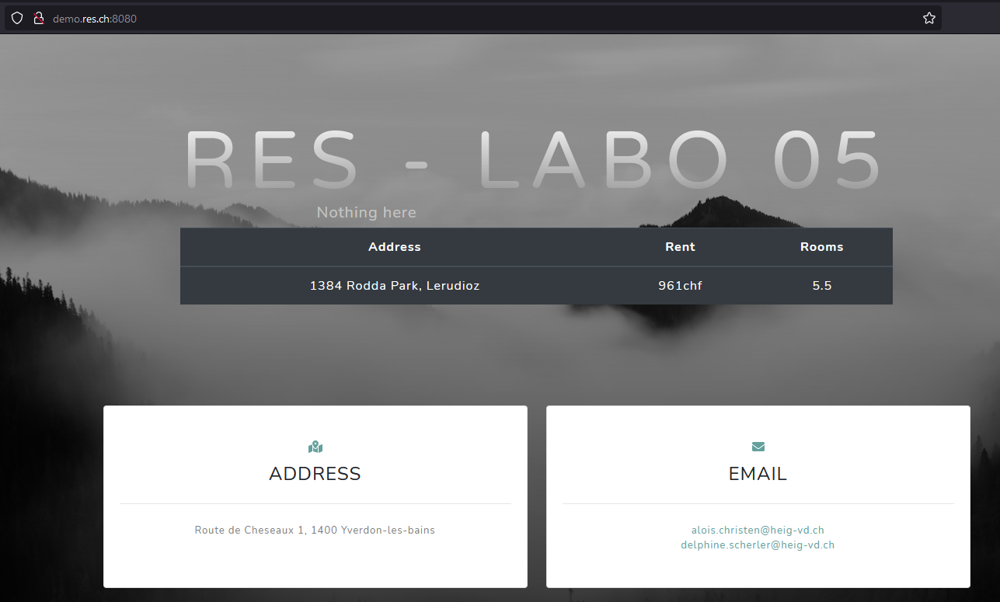

# Teaching-HEIGVD-RES-2021-Labo-HTTPInfra

## Objectifs

Le premier objectif de ce laboratoire est de se familiariser avec les outils logiciels qui nous permettront de construire une **infrastructure web complète**. Par cela, nous voulons dire que nous allons construire un environnement qui nous permettra de servir du **contenu statique et dynamique** aux navigateurs web. Pour ce faire, nous verrons que le serveur **apache httpd** peut agir à la fois comme un **serveur HTTP** et comme un **reverse proxy**. Nous verrons également que **express.js** est un framework JavaScript qui permet d'écrire très facilement des applications web dynamiques.

Le deuxième objectif est de mettre en œuvre une application Web dynamique simple, mais complète. Nous allons créer des ressources **HTML**, **CSS** et **JavaScript** qui seront servies aux navigateurs et présentées aux utilisateurs. Le code JavaScript exécuté dans le navigateur émettra des requêtes HTTP asynchrones à notre infrastructure Web (**requêtes AJAX**) et récupérera le contenu généré dynamiquement.

Le troisième objectif est de mettre en pratique notre utilisation de **Docker**. Tous les composants de l'infrastructure web seront empaquetés dans des images Docker personnalisées (nous créerons au moins 3 images différentes).

## Réalisation et documentations

Le laboratoire était séparé en 6 étapes : les 5 premières se faisaient en suivant les instructions, et permettaient de réaliser les objectifs du laboratoire.

Nous avons créé une documentation pour chacune des ces étapes : elles se trouvent dans le dossier `documentation`, et décrivent les différentes actions que nous avons entreprises pour réaliser l'étape.

La sixième étape consistait en plusieurs points bonus, libre à choix. Nous avons utilisé traefik, un outil nous facilitant grandement la réalisation de ces points bonus. Toute la mise en place et l'utilisation de traefik se trouve dans le dossier `documentation/additional_steps`

## Résultat final

Nous avons créé une infrastructure WEB dynamique et évolutive, qui respecte le cahier des charges. 

