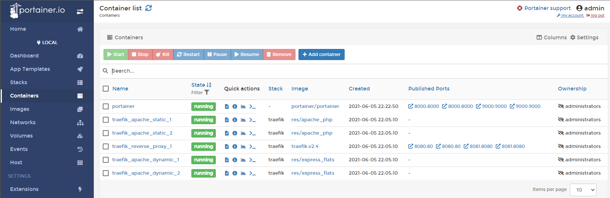

# Management UI

Nous avons trouvé un container qui proposait déjà une UI complète, il s'agit de [Portainer](https://www.portainer.io/).

Il suffit de lancer le container comme suit (sous Windows) :

```bash
docker run -d -p 9000:9000 -p 8000:8000 --name portainer --restart always -v /var/run/docker.sock:/var/run/docker.sock -v C:\ProgramData\Portainer:/data portainer/portainer
```

Nous avons créé le dossier C:\ProgramData\Portainer afin que notre configuration soit persistante.

Pour ouvrir notre Management UI il suffit de lancer http://localhost:9000 dans un navigateur et de s'y connecter.



Par exemple, nous voyons ici nos différents containers.