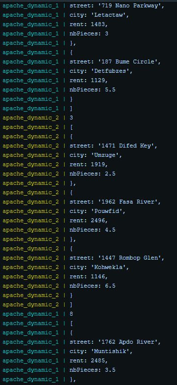

# Load balancing: multiple server nodes

### Traefik : qu'est-ce que c'est?

[Traefik](https://traefik.io/) est un edge routeur (reverse-proxy) open-source qui découvre automatiquement et dynamiquement la configuration des services. Il fonctionne avec la plupart des technologies cluster, en particulier avec Docker. 

### Traefik et Docker : comment cela fonctionne

Traefik est un container connecté en direct au deamon de Docker. Il va parcourir les événements afin d'observer les créations et destructions de containers. Avec Docker il se base sur des labels spécifiques lui permettant de reconnaître les services qu'il doit exploiter.

Comme beaucoup de labels sont à ajouter à chaque container, nous allons utiliser docker-compose qui nous permet de créer un container avec tous les labels nécessaires. Ceci nous évite de taper des commandes à rallonge, puisqu'il suffit d'appeler `docker-compose up -d` suivi du nom du container voulu.

### Contenu du fichier docker-compose.yml

```yaml
version: '3'

services:
  reverse_proxy:
    # The official v2 Traefik docker image
    image: traefik:v2.4
    # Enables the web UI and tells Traefik to listen to docker
    command: --api.insecure=true --providers.docker
    ports:
      # The HTTP port
      - "8080:80"      
      # The Web UI (enabled by --api.insecure=true)
      - "8081:8080"
    volumes:
      # So that Traefik can listen to the Docker events
      - /var/run/docker.sock:/var/run/docker.sock 
      
  apache_static:
    image: res/apache_php
    labels:
      - "traefik.http.routers.apache_static.rule=Host(`demo.res.ch`)"
      
  apache_dynamic:  
    image: res/express_flats
    labels:   
      - "traefik.http.routers.apache_dynamic.rule=Host(`demo.res.ch`) && Path(`/api/flats/`)"    
      - "traefik.http.services.dynamic_port_service.loadbalancer.server.port=3000"    
      - "traefik.http.middlewares.dynamic_replace_path.replacepath.path=/"     
      - "traefik.http.routers.apache_dynamic.middlewares=dynamic_replace_path"
```

Ce fichier contient la configuration pour lancer trois containers :

- reverse_proxy : Ce container traefik est créer à partir de l'image officielle, nous n'avons donc pas besoin de Dockerfile. Deux ports sont précisés un pour la connexion http et l'autre offrant des informations sur l'état courant de traefik. Il ne faut pas oublier de préciser le chemin d'accès des événements Docker.
- apache_static : Un container basé sur notre image res/apache_php, dans les labels nous définissons un router redirigeant les requêtes de l'hôte demo.res.ch sur ce container.
- apache_dynamic : Un container basé sur notre image res/express_flats. Nous avons défini les labels suivants :
  - Un router redirigeant les requêtes de l'hôte demo.res.ch/api/flats/ sur ce container, ce router est prioritaire par rapport au router de apache_static (la priorité est gérée par la longueur de la règle, mais pourrait être défini manuellement)
  - TODO services?
  - Un middleware qui remplace le path de la requête par /
  - La précision qu'on utilise le middleware sur le routeur. 

### Load balancing multiple nodes et dynamic cluster management

Traefik gère automatiquement le load balancing entre de multiples containers. De plus, comme il écoute automatiquement les événements, il met à jour l'infrastructure en conséquence et gère donc l'arrivée et le départ de containers dynamiquement.



Le load balancing à l'œuvre on voit que les containers dynamiques 1 et 2 sont mis à contribution à tour de rôles.

### Run des containers

Pour lancer toute l'infrastructure avec 2 serveurs static et 2 serveurs dynamic, lancer la commande suivante. À noter que le container reverse_proxy se lancera automatiquement.

```bash
docker-compose up -d --scale apache_static=2 --scale apache_dynamic=2
```

Si vous désirez changer le nombre de containers static (ou dynamic) vous pouvez avec la commande suivante :

```bash
docker-compose up -d --scale apache_static=4 apache_static
```

### Connexion au site grâce à un navigateur

Ouvrez votre navigateur et testez le lien suivant : 

demo.res.ch:8080 


