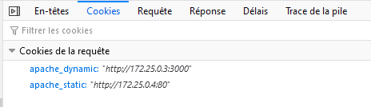
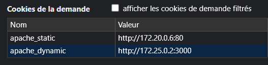

# Load balancing: round-robin vs sticky sessions

### Traefik round-robin

Le load balancing naturel de traefik, et en fait le seul disponible actuellement, utilise l'algorithme round-robin. Nous n'avons donc rien à configurer à ce niveau là. 

### Sticky sessions

Pour implémenter les sticky sessions nous avons utilisé les cookies, pour cela nous avons dû introduire deux lignes dans les labels de notre docker_compose.yml

Pour apache_static :

```yaml
- "traefik.http.services.static_service.loadbalancer.sticky.cookie.name=apache_static"
```

Pour apache_dynamic :

```yaml
- "traefik.http.services.dynamic_service.loadbalancer.sticky.cookie.name=apache_dynamic"
```

### Sticky sessions en action





Ici nous avons lancé deux fois la page web sur des navigateurs différents et nous voyons que les sticky sessions sont bien différentes.
